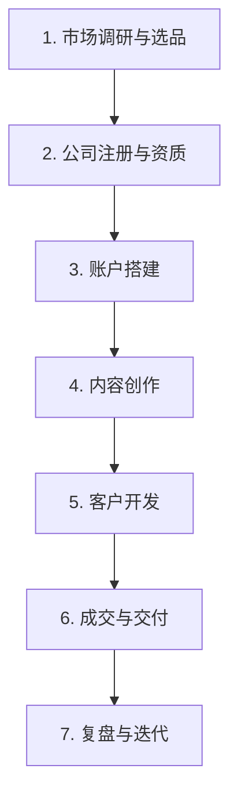

# SOHO 外贸全流程指南（2025-2026 版）

> 面向技术背景新手的实战流程图
> 数据来源：福步论坛、米课圈、知乎、跨境知道、AB客、奇赞

---

## 一、整体流程图



---

## 二、详细流程说明

### 1. 市场调研与选品

#### 目标
找到有需求、利润高、竞争不激烈的 1-2 个产品

#### 具体步骤

**1.1 确定品类方向**
- 从你熟悉的行业入手（如户外用品、家居装饰）
- 或者用 Google Trends 查看品类趋势
- 优先考虑：
  - 高利润率（毛利 > 30%）
  - 高复购率
  - 高客单价（$50+）
  - 低竞争度

**1.2 分析市场需求**
- **Amazon Best Sellers / AliExpress 热销榜**：看哪些产品卖得好
- **海关数据**：查目标产品的出口量/目的国/价格区间
- **Google Trends**：看品类搜索趋势
- **YouTube/Reddit**：看用户讨论痛点

**1.3 供应链调研**
- **1688/阿里巴巴**：筛选 3-5 家供应商
- **工厂直采**：联系产业带工厂
- **义乌**：小商品天堂，适合小批量
- **关键点**：索要样品和报价，确认产品认证（CE/RoHS/FDA 等）

**1.4 利润测算**
```
净利润 = 销售收入 - 采购成本 - 内陆运费 - 国际运费 - 平台手续费 - 汇损 - 杂费
```
- 保证净利润率 > 15%
- 起步阶段用"一件代发"或小批量试单降低风险

#### 工具推荐
- 图灵搜：地图搜索客户+决策人挖掘
- 网易外贸通：多渠道营销+客户管理
- Google Trends：市场趋势分析
- Amazon Best Sellers：竞品分析

---

### 2. 公司注册与资质

#### 目标
合法开展外贸业务

#### 具体步骤

**2.1 注册公司**
- 选择"贸易有限公司"（比个体户更显专业）
- 找代理注册（2,000-3,500元，1-3天搞定）
- 包含：营业执照 + 进出口权办理

**2.2 开通收款账户**
- **XTransfer/PingPong**：大额 T/T 收款（推荐起步首选）
- **PayPal**：小额样品单（<$1,000）
- **Wise Business**：多币种管理

**2.3 企业邮箱**
- 用公司域名注册（info@yourcompany.com）
- 推荐：Zoho Mail（免费5用户）、Google Workspace（$6/月）

#### 注意事项
- 必须有营业执照才能做网站ICP备案、开通收款账户
- 建议注册"贸易有限公司"，比个体户更显专业

---

### 3. 账户搭建

#### 目标
建立专业的品牌形象

#### 具体步骤

**3.1 TikTok 账号**
- 注册 TikTok Business 账号
- 完善资料：头像、简介、联系方式（WhatsApp/邮箱）
- 前期不需要投广告，先做内容

**3.2 独立站**
- **WordPress + 主题**：自己搭（技术背景优势），买个好主题
- **Shopify**：零代码，快速上线
- **必备页面**：首页、产品页（每个SKU单独一页）、About Us、联系方式、物流售后政策

**3.3 社媒矩阵**
- LinkedIn：找采购决策人
- Facebook/Instagram：品牌宣传
- YouTube：长视频内容

#### 技术背景优势
- 自己搞定 WordPress 部署、SSL 证书、SEO 基础优化
- 用 AI 生成产品描述、博客文章

---

### 4. 内容创作

#### 目标
通过内容吸引潜在客户

#### 具体步骤

**4.1 TikTok 视频**
- **工厂实拍**：展示生产过程、质检、包装
- **产品展示**：开箱、使用场景、对比测试
- **痛点解决**：你的产品解决什么问题
- **客户案例**：发货过程、客户反馈

**4.2 内容制作**
- 手机拍摄 + 简单剪辑（剪映/CapCut）
- 英文字幕必须有（用 AI 工具自动生成）
- 每周发 3-5 条，保持更新频率

**4.3 SEO 内容**
- 在独立站写产品相关文章
- 关键词优化，让客户 Google 搜到你
- 每周 2-3 篇

#### AI 辅助
- AI 生成文案
- AI 生成图片（Midjourney/DALL-E）
- AI 生成字幕

---

### 5. 客户开发

#### 目标
获取询盘并转化为订单

#### 具体步骤

**5.1 TikTok 获客**
- 视频爆了 → 评论区/私信引导到 WhatsApp/邮箱
- 或者开 TikTok Shop
- 或者引流到独立站

**5.2 LinkedIn 开发**
- 搜索采购决策人
- 发送开发信（每周 50-100 封）
- 用 AI 批量写开发信

**5.3 独立站 SEO**
- AI 生成产品描述、博客文章
- 关键词优化
- 长期获客，3-6 个月见效

**5.4 开发信**
- 用 AI 批量写开发信
- 针对不同客户定制
- 每周 50-100 封

#### 工具推荐
- Zoho CRM / HubSpot：客户管理
- Mailchimp / Zoho Campaigns：邮件营销
- Google Analytics：数据分析

---

### 6. 成交与交付

#### 目标
完成交易，获得收入

#### 具体步骤

**6.1 回复询盘**
- 快速回复（2小时内）
- 专业报价单 PI
- 提供样品

**6.2 订单处理**
- 下单生产
- 验货
- 安排物流

**6.3 收款**
- 使用 XTransfer/PingPong 收款
- 大额订单走 T/T

**6.4 交付**
- 准备报关单据
- 发货
- 提供物流追踪

#### 注意事项
- 保留所有物流追踪证据
- 大额订单不用 PayPal，走 T/T
- 高风险地区订单谨慎处理

---

### 7. 复盘与迭代

#### 目标
持续优化，提高效率

#### 具体步骤

**7.1 数据分析**
- TikTok 视频播放量、互动率
- 独立站流量、转化率
- 询盘回复率、转化率

**7.2 优化策略**
- 根据数据调整内容方向
- 优化客户开发话术
- 优化产品组合

**7.3 扩展渠道**
- 成熟后考虑阿里国际站
- 组建团队
- 发展品牌

#### 核心指标
- 每周开发信发送量：50-100 封
- 邮件回复率：≥ 5%
- LinkedIn 回复率：≥ 10%
- 样品转化率：≥ 20%
- 独立站转化率：0.5%-1%（起步）
- 首单时间：2-6 个月（正常范围）

---

## 三、关键时间节点

| 阶段 | 时间 | 说明 |
|------|------|------|
| 市场调研+选品 | 3-7天 | 快速验证，不要花太长时间 |
| 建站+基础设置 | 2-4周 | 独立站/阿里平台+企业邮箱+收款账户 |
| 客户开发启动 | 1-3个月 | 社媒运营+主动开发，"用心运营一般2-3个月会有一定结果" |
| **第一单** | **3-6个月**（有老客户基础）/ **6-12个月**（纯从零开始） | 样品单→小批量→正式订单 |
| 稳定出单 | 1-2年 | 有2-3个稳定客户，基本温饱 |

---

## 四、避坑指南

1. **不要一上来投阿里国际站**：年费3-10万，新手难回本
2. **不要没注册就卖货**：第一步注册公司+进出口权
3. **不要贪多品类**：聚焦1-2个SKU深耕
4. **不要先囤货再找客户**：先卖后买
5. **不要忽视收款成本**：报价必须算手续费和汇损（可能被扣5-8%）
6. **不要用个人邮箱**：域名邮箱是最低成本的专业投资
7. **不懂外贸术语就干**：至少搞清 FOB/CIF/EXW、T/T/L/C
8. **客户过度集中**：单一客户不超过30%收入
9. **信用卡Chargeback风险**：大额走T/T，保留物流证据
10. **忽视退税**：出口退税是额外利润，选能开增值税专票的供应商
11. **买各种外贸软件**：起步用免费工具，赚了钱再投入

---

## 五、学习资源

### 书籍
- 《中间人经济》— 理解贸易商的价值定位
- 《领导梯队》— 从业务能手到管理者
- 《外贸高手客户成交技巧》（毅冰）

### 公众号
- **料神/料网**（liaosam.com）— 开发信经典教程
- **汪晟** — Google开发客户
- **毅冰** — 邮件写作、客户跟进
- **颜Sir** — 社媒营销、LinkedIn获客

### 社群/课程
- **米课**（ask.imiker.com）— 付费课程+社群
- **奇赞**（qizansea.com）— 品牌出海知识社区
- **福步论坛**（bbs.fobshanghai.com）— 中国最大外贸论坛
- **AB客**（cnabke.com）— SOHO实操指南

### 工具
- 图灵搜 — 地图搜索客户+决策人
- 网易外贸通 — 多渠道营销
- Google Analytics / Search Console — 数据分析

---

## 六、核心结论

### SOHO 外贸是否值得投入？

✅ 有外贸经验+客户资源 → 高概率成功
✅ 有技术背景+愿意学行业 → 中等概率，但天花板可更高
❌ 零经验零资源零资金 → 大概率失败（90%一年内退出）

### 收入预期
- 第1年：0-10万（可能亏损）
- 第2-3年：10-30万（稳定后温饱）
- 第3-5年：30-100万（如果做对了选品和客户开发）
- 天花板：纯SOHO年入100-300万

> "好的SOHO肯定是一个好的外贸业务员。技术是工具，**行业认知和客户关系才是护城河**。"

---

*报告完毕。数据来源：福步论坛、米课圈、知乎、跨境知道、AB客、奇赞*
